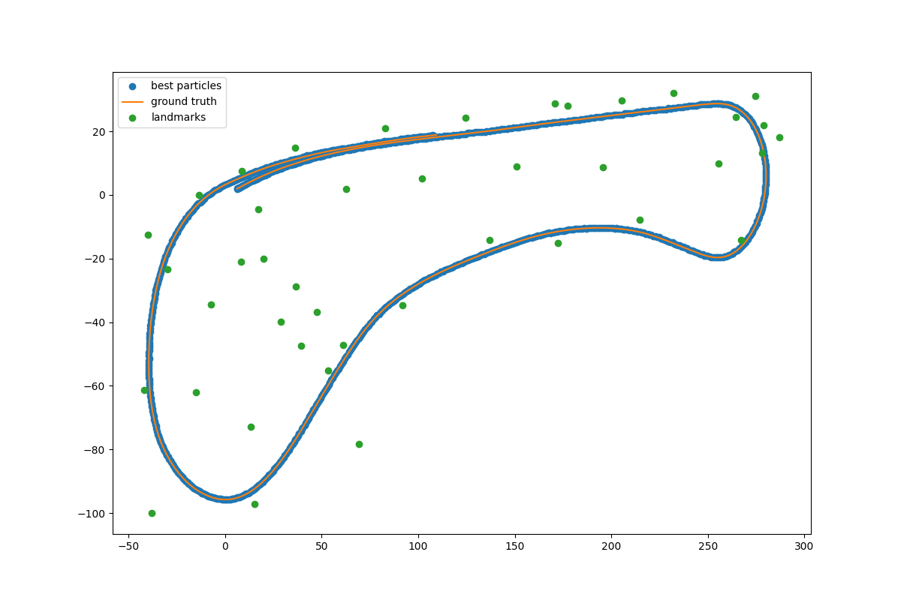

#Overview
This repository achieves a 2-D particle filter of a self-driving vehicle in C++. The particle filter will be given a map of landmark and an initial localization. The particle filter will get noisy control and observation data. And then the program will calculate and output best particle location.

Finally, draw particle trajectory diagrams using Python scripts.
#Running
run `src/main.cpp` - calculate the best particle location

run `draw.py` - draw the particle trajectory diagrams

#Input Data
- data/control_data.txt : the velocity and yaw rate of the sensor.
- data/gt_data.txt : the ground truth data of XY coordinates and yaw of the vehicle.
- data/map_data.txt : the data of XY coordinates of landmarks.
- data/observation : observation data of sensor at each time step.
#Result

#References
https://zhuanlan.zhihu.com/p/107223012
